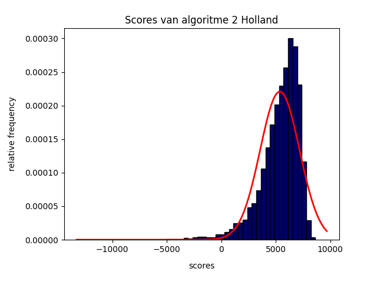
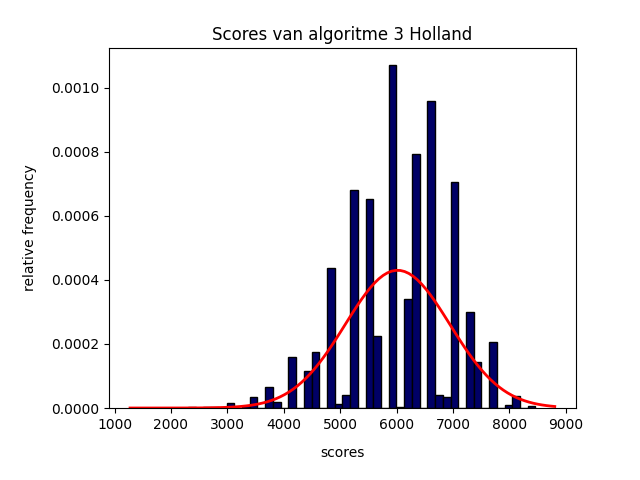

# Baseline

### De Sociale Wetenschappers

## Intro

Wij hebben 3 random algoritmes geschreven. Elk van deze kiest willekeurig een start-connectie voor alle routes en plakt hier vervolgens willekeurige connecties aan. De verschillen tussen de 3 algoritmes zijn:

- **Algoritme 1**:  Altijd 1 route. Mag oneindig lang. Stopt als alle connecties gereden zijn.
- **Algoritme 2**: (kan) Oneindig veel routes. Mogen time-frame niet overschrijden. Stopt als alle connecties gereden zijn.
- **Algoritme 3**: Altijd 7 routes. Deze mogen time-frame niet overschrijden. Stopt als 7 routes van maximale lengtes bestaan.

## Results

(Afgerond op 2 decimalen)

| Alg 1              | Alg 2 | Alg 3 |
| :----------------: | :------: | :----: |
|         |      |  |

- **Algoritme 1**
    - *Mean*= ``5975``
    - *Standard Deviation*= ``2101.81``
    - *Min score*= ``-13600``
    - *Max score*= ``9025``

- **Algoritme 2**
    - *Mean*= ``5373.78``
    - *Standard Deviation*= ``1804.37``
    - *Min score*= ``-12228``
    - *Max score*= ``8636``

- **Algoritme 3**
    - *Mean*= ``6017.65``
    - *Standard Deviation*= ``928.35``
    - *Min score*= ``1616``
    - *Max score*= ``8463``

- **Totaal**
    - *Mean*= ``5788.94``
    - *Standard Deviation*= ``1712.13``
    - *Min score*= `-13600`
    - *Max score*= ``9025``

Histogram             |  Boxplot
:-------------------------:|:-------------------------:
   |  

## Conclusies

### 'Wat is goed'?
Het gemiddelde van alle scores is ``5788.95``. Dit is een goede graadmeter voor ons (toekomstige) algoritme voor een *MINIMALE* score. Echter zijn de standaard deviatie en (negatieve) uitschieters extreem (zie minimale scores en de boxplots); het gemiddelde is dus maar beperkt representabel voor wat 'goed' is.

Om dit in kaart te brengen gebruiken we de (hoogste) scores van de daadwerkelijk correcte oplossingen. Deze zitten allemaal tussen de ``8300-8600``. Dit gaat ons streven worden.

### Hoe Uniform?

De simpelste en meest voor de hand liggende conclusie is dat onze steekproef **niet** uniform is. Ten eerste heeft elk van onze algoritmes een vorm van bias doormiddel van de  toegevoegde constraints. Dit maakt ze dus niet *compleet* willekeurig.

Daarnaast hebben we een (relatief) gelimiteerde hoeveelheid (30.000) verschillende states. 30.000 is (enorm) veel kleiner dan onze berekende state-space en wij zullen slechts een gedeelte van onze de space hebben gebruikt.

Echter hebben we hiervoor gecompenseerd. Door 3 verschillende algoritmes toe te passen, elk met net een ander 'randomheid', proberen meer van de state-space in kaart te brengen.

<u>Conclusie</u>: Onze huidige steekproef is niet compleet uniform en dus beschrijft niet de complete state-space. Echter, omdat dit niet realistisch is en wij maatregelen hebben genomen om dit tegen te gaan, is dit in onze ogen geen probleem. De steekproef is dus niet compleet, maar wel genoeg representabel.