<!-- _paginate: skip -->
<br>
<br>
<br>

# Sociale Wetenschappers
Lieke | Rayen | Gert

---
## Case: RailNL
- Routes maken
- Constraints
<br>

- Doel: zo efficiënt mogelijke lijnvoering

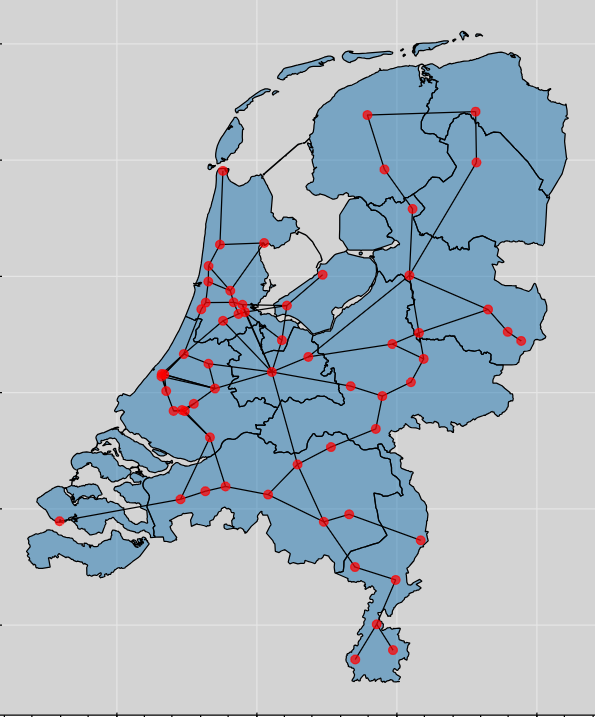

---
## Terminologie
- **Connecties**: spoorverbinding tussen twee stations


---

## Terminologie
- **Connecties**
<br>

- **Route**: combinatie van connecties tussen stations

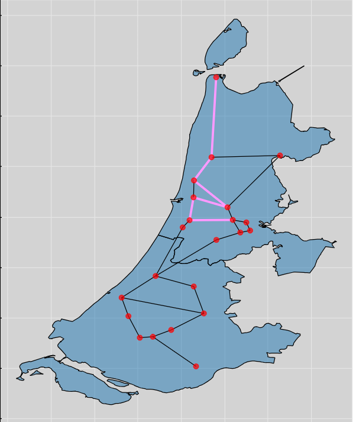

---
## Terminologie
- **Connecties**
<br>

- **Route** 
<br>

- **State**: lijnvoering op bepaald moment

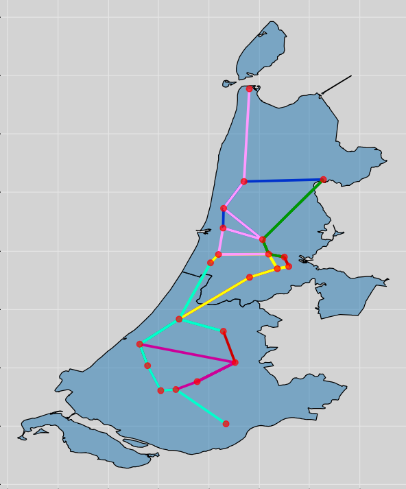

---
## Holland

#### Input

- 28 connecties
- 22 stations 
<br> 
 
#### Constraints
- Maximaal 7 routes
- Timeframe van 120 minuten


---
## Nederland
#### Input

- 89 connecties
- 61 stations 
<br> 

#### Constraints
- Maximaal 20 routes
- Timeframe van 180 minuten


---
## Het probleem
- Doelfunctie
- Constraints
- Statespace

---
## Het probleem - doelfunctie
```python
K = p * 10000 - (T * 100 + Min)
```

- 10.000 als alle connecties gebruikt zijn
    - -100 voor elke route
    - -totaal aantal minuten

---
## Het probleem - constraints
- Maximum routes
- Timeframe


---
## Het probleem: statespace
- Alle mogelijke routes
- Alle mogelijke combinaties van routes
- Grote statespace
- Veel lokale optima


---
<!-- _paginate: skip -->

<br>
<br>
<br>
<br>

# Algoritmen & Methoden


---

## Baseline

- Holland
  - Realistisch: ``8300-8600``
  - Maximum : ``9219``
<br>
- NL: 
  - Realistisch: ``+/- 4000``
  - Maximum: ``7549``


---

(Overzicht van alle algoritme)

---

## Heuristieken

- Aan de voorkant
  - Geïsoleerde stations
- Bij evaluatie van scores
  - Plus- en minpunten
  - Meervoudig gebruik connecties


---

## LRA

- Voor het maken van een **valide state**


- Maakt nieuwe routes tot *valide state*

- Voegt connecties toe tot *timeframe* is bereikt

- Geeft voorrang aan *ongebruikte connecties*

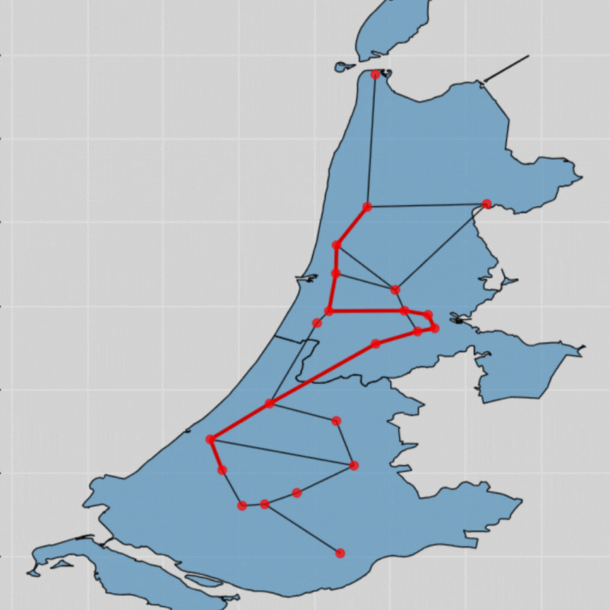

---

## Hill-climber
- Maak start-state

- Maak aanpassing
    - Verwijderen connectie
    - Toevoegen connectie
    - Verwijderen route
    - Toevoegen route

- Vergelijk score


---


## Plant propagation - Overview

- Genetic Algorithm
- Hill-Climbers

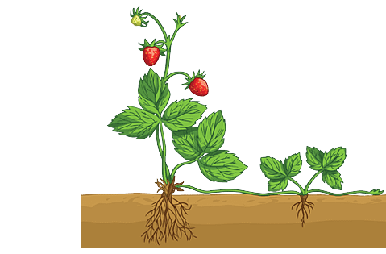

---
## Plant propagation - runners
- Ver en weinig vs. dichtbij en veel
- Afstand
- Richting
  - Heuristieken

---

## Resulaten


---
## Resultaten - Hill Climber

- High-scores
  - Holland: ``9200``
  - NL: ``6500``


---

## Resultaten - Hill Climber

- Heavy vs. Light  

[assets/plots_def/histo_hill_climber_netherlands_random_heavy.png]
[assets/plots_def/histo_hill_climber_netherlands_random_light.png]
--> TODO: deze op schaal 0 - 4000

---
## Resultaten - Hill Climber

- Random vs. valid

[assets/plots_def/histo_hill_climber_holland_random_heavy.png] 

[assets/plots_def/histo_hill_climber_holland_random_light.png]


---

## Resultaten - Hill Climber

- Random vs. valid
- Disclaimer: valid duurt lang bij grote state-space
 


---

## Resultaten - Simulated Annealing

- 200 beste temperatuur
- Log vs. Linear vs. Expo
 


---

## Resultaten - Simulated Annealing

- Log vs. Linear vs. Expo
 
TODO: grafiek met beste scores van de 3 coolingschemes

---

## Resultaten - Simulated Annealing

- Logaritmisch
 
TODO: line_plaatje valid 200 logaritmisch (wel/niet NL) 

---
## Resultaten - Plant Propagation

- Filters
- Parameters
- heuristiek
- valid vs. random
- verandering is niet goed

---

<!-- _paginate: skip -->
---

# Extra Info

--- 
## State Space - Formule

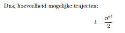

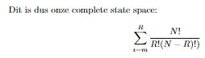

--- 
## State space - deel 1

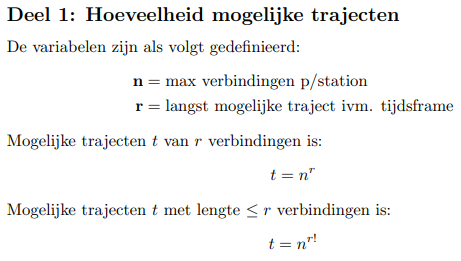
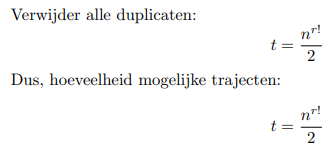

---

## State space - deel 2
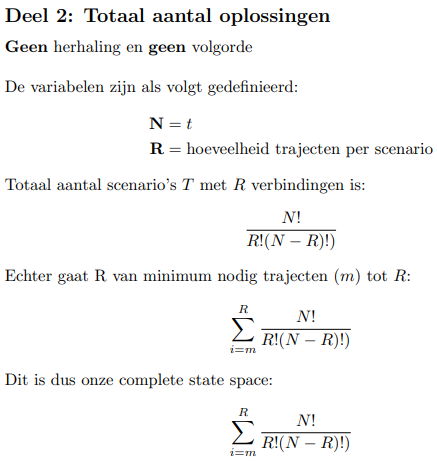

---

## Baseline - Holland
Histogram totaal            |  Boxplot alle algoritmen
:-------------------------:|:-------------------------:
  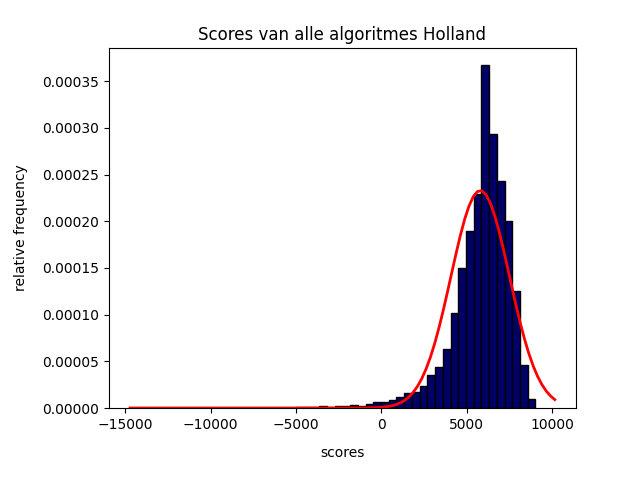 | 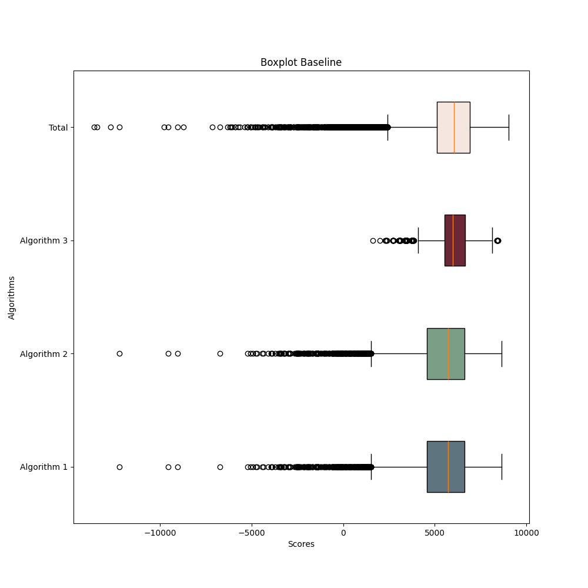

---

## Baseline Holland  - Results Table

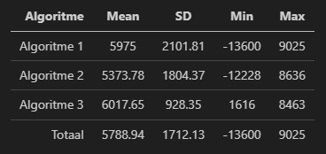


---

## Baseline Holland - Algorithm Histograms
| Algoritme 1              | Algoritme 2 | Algoritme 3 |
| :----------------: | :------: | :----: |
| 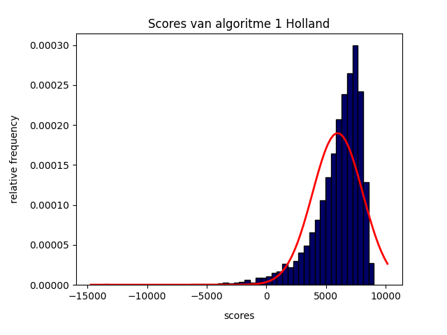 |  | 

--- 
## Baseline Holland - Solved State Results

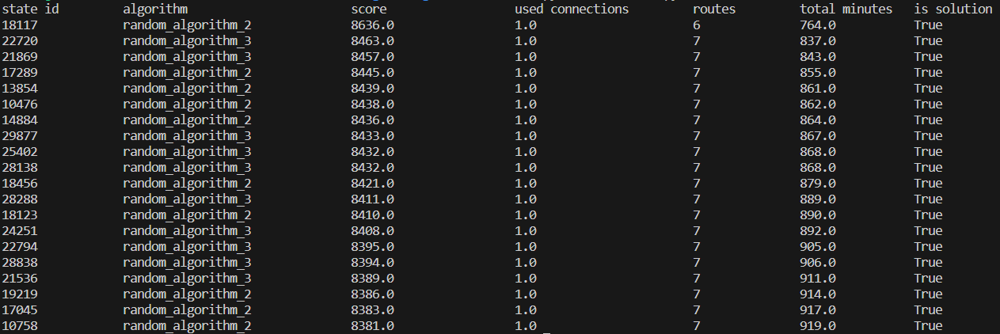

---

## Baseline NL - Histogram & Boxplot

TODO:

---


## Baseline NL - Solved States Results

TODO:

---

## PPA - Uitleg

Originale Paper            |  ChatGPT
:-------------------------:|:-------------------------:
  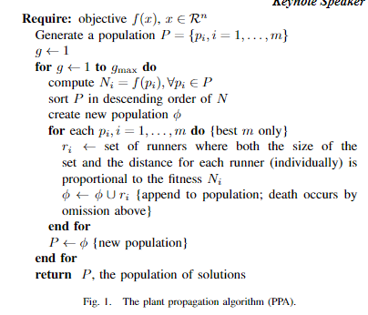 | 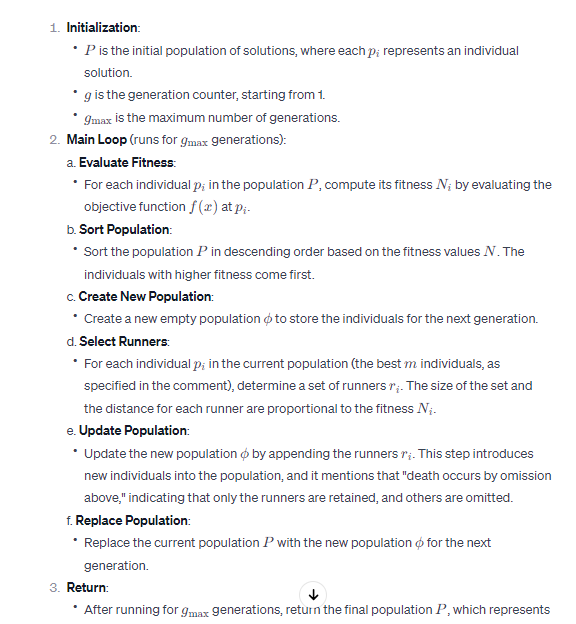

  ---
## PPA - Fitness Functions

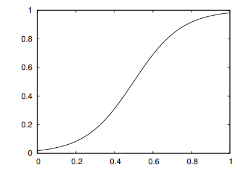

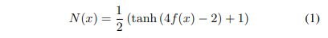

---
## PPA - Other Functions

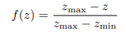

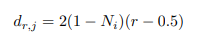

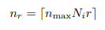

---

## UML

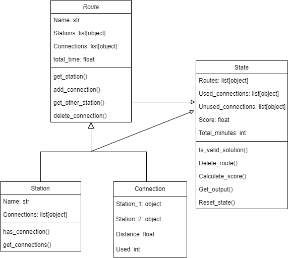

---
## Simulated Annealing - Results

TODO: opvullen

---
