<!-- _paginate: skip -->
<br>
<br>
<br>

# Sociale Wetenschappers
Lieke | Rayen | Gert

---
## Case: RailNL
- Routes maken
- Constraints
<br>

- Doel: zo efficiënt mogelijke lijnvoering


---
## Terminologie
- **Connecties**: spoorverbinding tussen twee stations


---

## Terminologie
- **Connecties**
<br>

- **Route**: combinatie van connecties tussen stations


---
## Terminologie
- **Connecties**
<br>

- **Route** 
<br>

- **State**: lijnvoering op bepaald moment


---
## Holland

#### Input

- 28 connecties
- 22 stations 
<br> 
 
#### Constraints
- Maximaal 7 routes
- Timeframe van 120 minuten


---
## Nederland
#### Input

- 89 connecties
- 61 stations 
<br> 

#### Constraints
- Maximaal 20 routes
- Timeframe van 180 minuten


---
## Het probleem
- Doelfunctie
- Constraints
- Statespace

---
## Het probleem - doelfunctie
```python
K = p * 10000 - (T * 100 + Min)
```

- 10.000 als alle connecties gebruikt zijn
    - -100 voor elke route
    - -totaal aantal minuten

---
## Het probleem - constraints
- Maximum routes
- Timeframe


---
## Het probleem: statespace
- Alle mogelijke routes
- Alle mogelijke combinaties van routes
- Grote statespace
- Veel lokale optima


---
<!-- _paginate: skip -->

<br>
<br>
<br>
<br>

# Algoritmen & Methoden


---

## Baseline

- Holland
  - Baseline: ``8300-8600``
  - Maximum : ``9219``
<br>
- NL: 
  - Baseline: ``+/- 4000``
  - Maximum: ``7549``


---
## Heuristieken

- Constraint: alle connecties bereden

- Valide start state
  - Voorkeur aan onbereden connecties
  - Routes maximaal gevuld


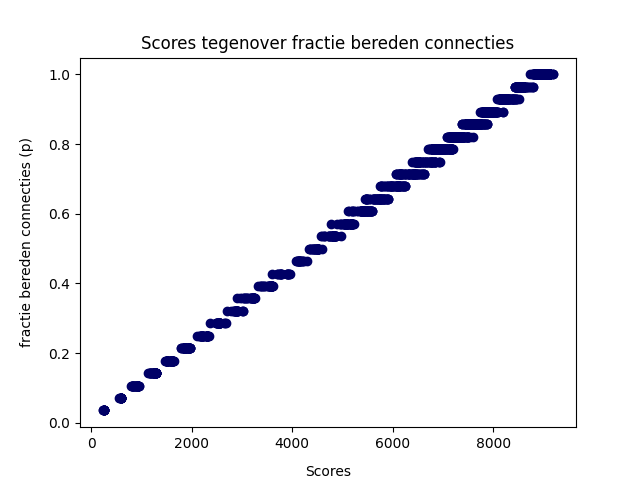

---

## Algoritmen
- Hillclimber
- Simulated annealing
- Plant propagation
---

## Opties
- Start state: valid/random
- Verandering: light/heavy
- Specifieke parameters

---

## Hillclimber
- Maak start-state
  - Valid of random

- Maak aanpassing
    - Light of heavy

- Vergelijk score


---
## Simulated annealing
- Acceptatiekans
- Temperatuur
- Koeling schema

---


## Plant propagation - Overview

- Genetic Algorithm
- Specifieke parameters:
  - Populatie
  - Aantal runners
  - Aantal generaties


---
<!-- _paginate: skip -->
<br>
<br>
<br>
<br>

# Resulaten

---
<br>
<br>
<br>
<br>

## Resultaten - Hillclimber

---
## Resultaten - Hillclimber

Random           | Valid
:-------------------------:|:-------------------------:
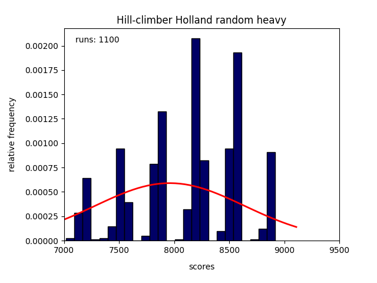 | 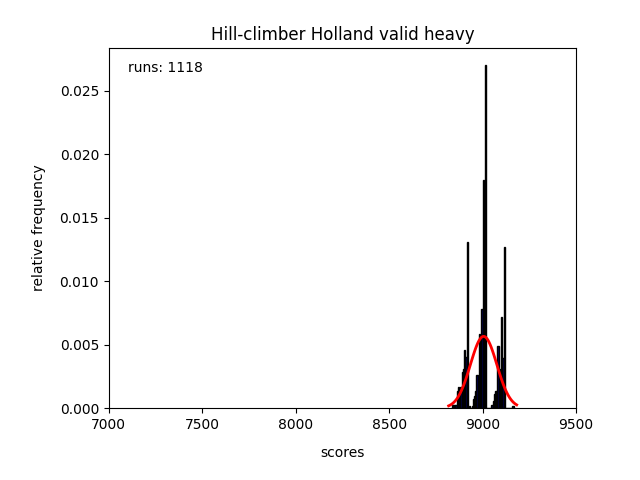
---

## Resultaten - Hillclimber 

Light           | Heavy
:-------------------------:|:-------------------------:
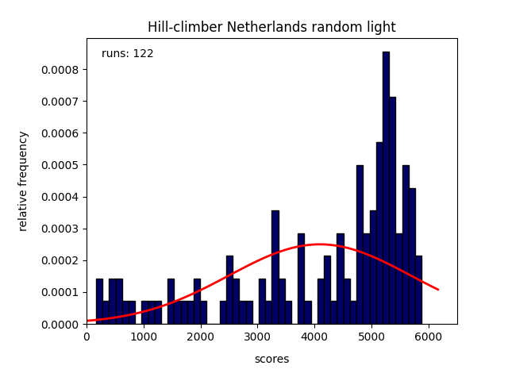 | 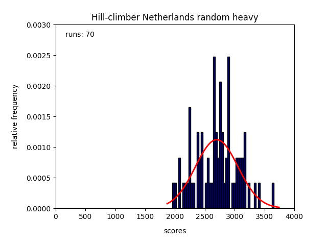


---
## Resultaten - Hillclimber
Dus:
- Valid is beter
- Heavy is beter

---
<br>
<br>
<br>
<br>

## Resultaten - Simulated Annealing

---

## Resultaten - Simulated Annealing

- 200 beste temperatuur
 


---

## Resultaten - Simulated Annealing

- 200 beste temperatuur
- Log vs. Linear vs. Expo

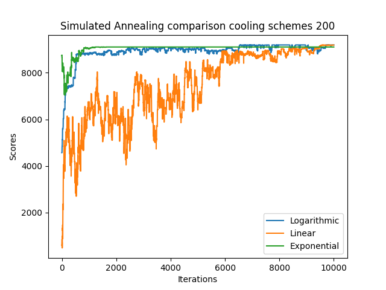

---
## Resultaten - Simulated Annealing

Lineair | Exponentieel | Logaritmisch
:------------:|:------------:|:---------:
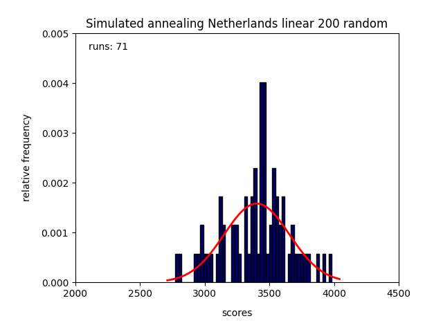 | 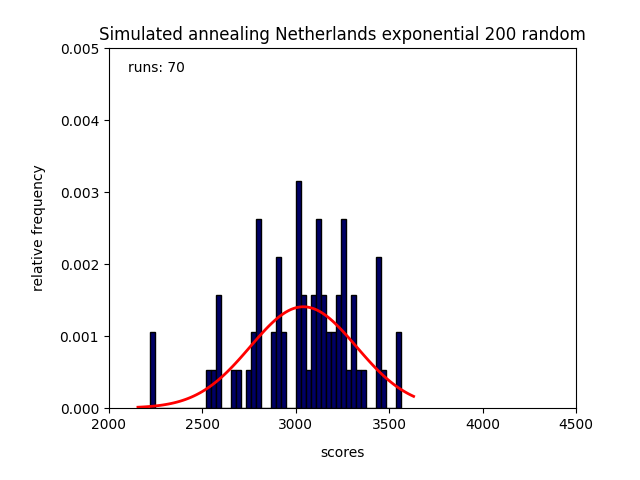 | 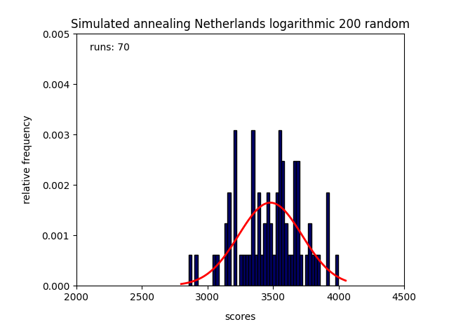

---
## Resultaten - Simulated Annealing

- Logaritmisch


---
## Resultaten - Plant Propagation

- Parameters
- Valid vs. random


---

## Resultaten - Plant Propagation

- Nog geen goede resultaten
- Niet beter dan hillclimber
- Oorzaak:
  - Mutaties gaan nog niet goed

---

## Resultaten - Plant Propagation

- Gevolg: afhankelijk van lokale minima


---
## Conclusie
- Simulated annealing is het best
  - Valid start state
- Plant propagation heeft potentie

---
## Future work
- Heuristieken implementeren
- Plant propagation finetunen


---
<!-- _paginate: skip -->
---

# Extra Info

--- 
## State Space - Formule


--- 
## State space - deel 1


---

## State space - deel 2


---

## Baseline - Holland
Histogram totaal            |  Boxplot alle algoritmen
:-------------------------:|:-------------------------:
   | 

---

## Baseline Holland  - Results Table


---

## Baseline Holland - Algorithm Histograms
| Algoritme 1              | Algoritme 2 | Algoritme 3 |
| :----------------: | :------: | :----: |
|  |  | 

--- 
## Baseline Holland - Solved State Results


---

## Baseline NL - Histogram & Boxplot

TODO:

---


## Baseline NL - Solved States Results

TODO:

---
## Simulated annealing - random vs. valid

Random            |  Valid
:-------------------------:|:-------------------------:
  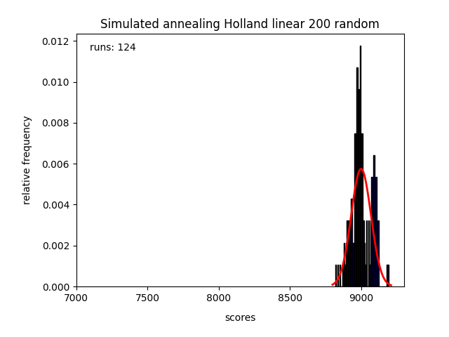 | 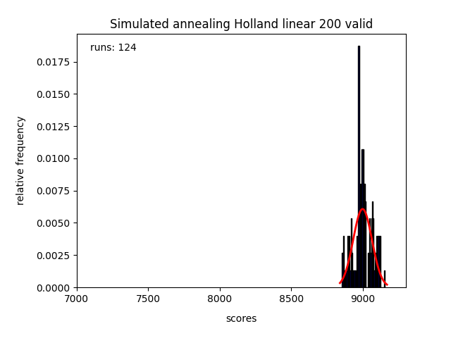

---

## PPA - Uitleg

Originale Paper            |  ChatGPT
:-------------------------:|:-------------------------:
   | 

  ---
## PPA - Fitness Functions


---
## PPA - Other Functions


---

## UML


---
## Simulated Annealing - Results

TODO: opvullen

---
